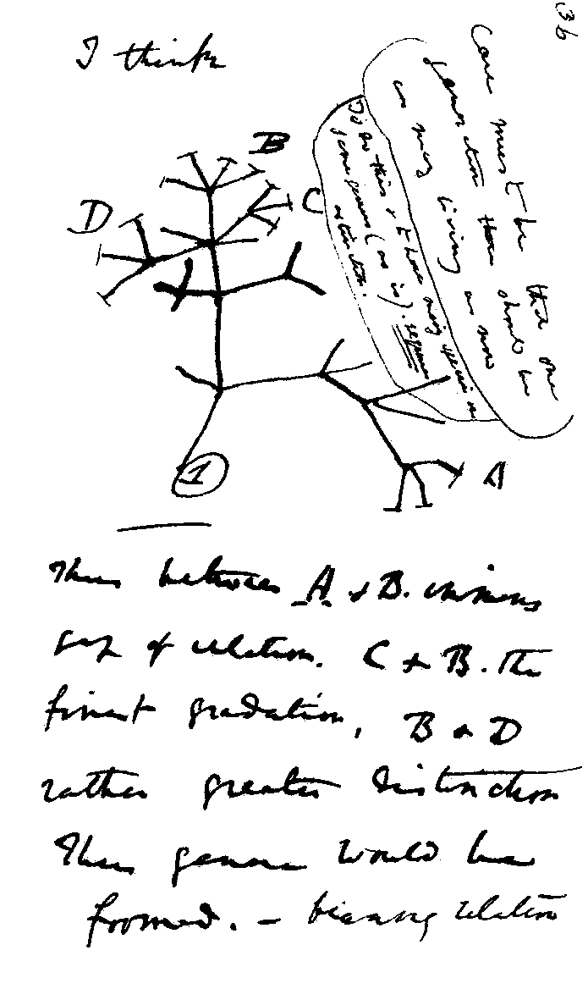
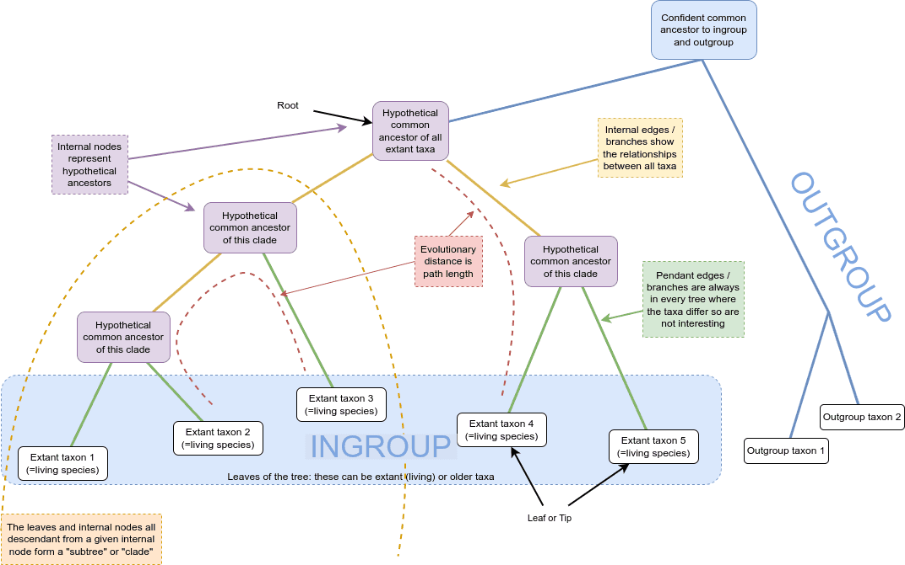
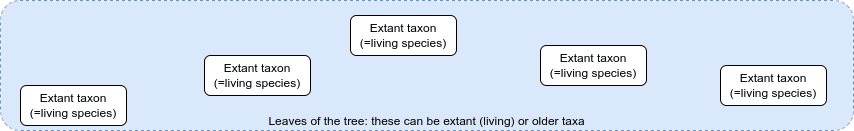
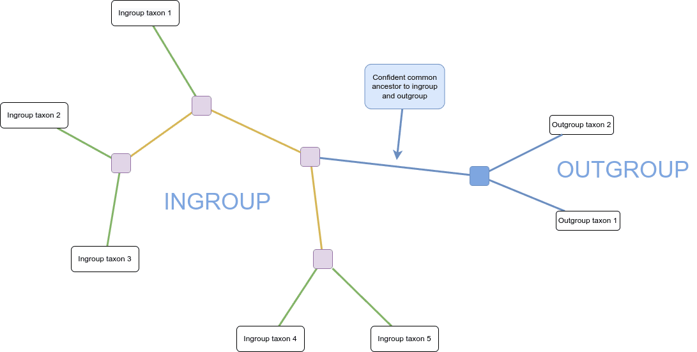
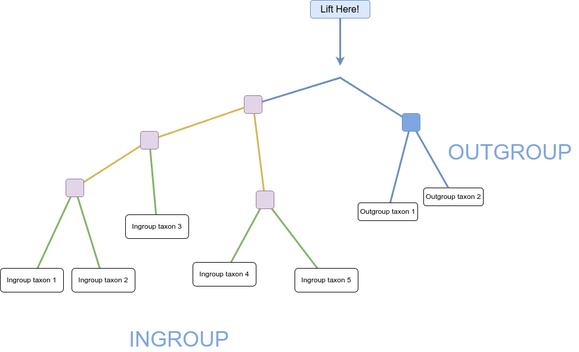
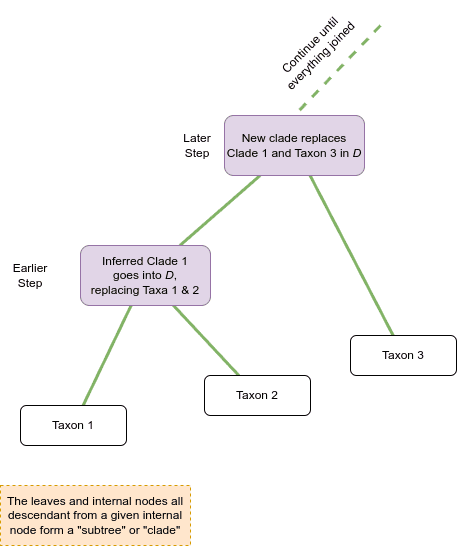
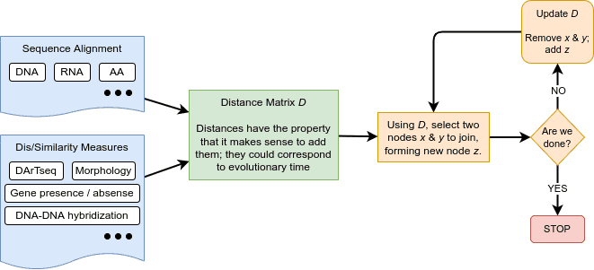
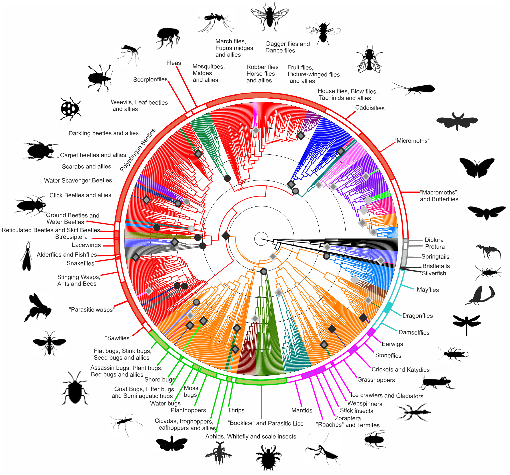
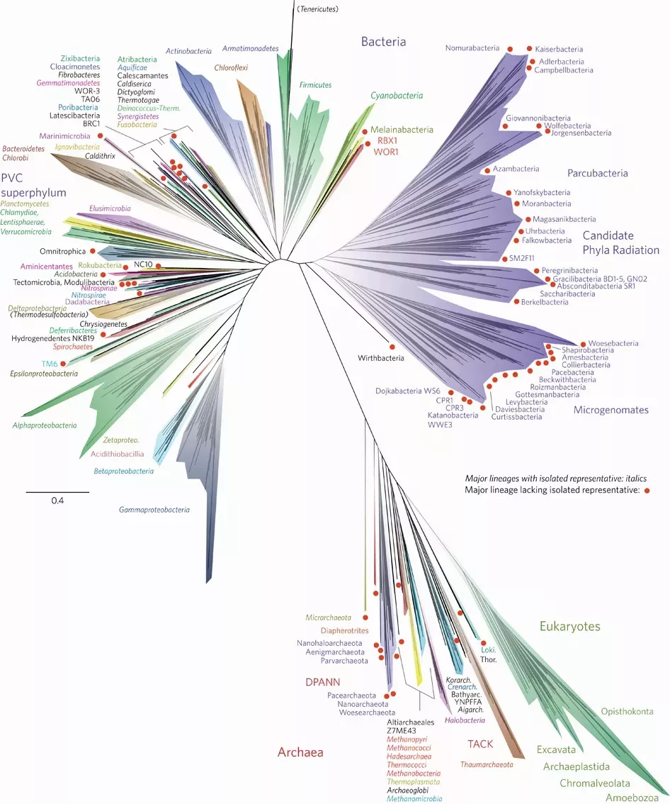

# 🌳 Phylogenetics — Back to Basics

A visual introduction to **phylogenetic trees, evolutionary relationships, clades, rooting, outgroups, and tree construction**.

---

## 🧬 What is Phylogenetics?

**Phylogenetics** studies the evolutionary relationships between organisms, genes, or other taxa.

A **phylogenetic tree** represents these relationships:

* 🌿 **Leaves / Tips** → Taxa
* 🟣 **Internal Nodes** → Hypothetical ancestors
* 🌳 **Branches** → Evolutionary relationships
* 🔵 **Root** → Common ancestor
* 🌱 **Clade** → Ancestor + descendants

[](images/Darwin_tree.png)

---

## 🌳 Tree Anatomy

[](images/TreeAnatomyWithOutgroup.png)

* **Rooted tree** → Shows evolutionary direction
* **Unrooted tree** → Shows relationships without direction
* **Ingroup** → Main group being studied
* **Outgroup** → Related group used to help root the tree

### Leaves

[](images/WeJustHaveLeaves.png)

---

## 🌿 Rooting a Tree

An unrooted tree does not show evolutionary direction.

[](images/TreeAnatomyUnrooted.png)

An **outgroup** can help identify the position of the root.

[](images/TreeAnatomyLiftHere.png)

---

## 🔗 Clades

A **clade** contains a common ancestor and all of its descendants.

[](images/JoiningCladesForTreeConstruction.png)

Two taxa or clades can be joined to create a new clade until the tree is complete.

---

## 📊 Building a Phylogenetic Tree

```text
Biological Data
      ↓
Sequence Alignment
      ↓
Distance / Similarity
      ↓
Distance Matrix
      ↓
Join Taxa / Clades
      ↓
Phylogenetic Tree
```

[](images/TreeConstruction.drawio.png)

---

## 🧬 Types of Data

Phylogenetic trees can be constructed using:

* DNA
* RNA
* Amino acid sequences
* Gene presence/absence
* Morphological characteristics
* Similarity/distance measures

---

## 🧪 Phylogenetic Methods

| Method                    | Main idea                        |
| ------------------------- | -------------------------------- |
| **Neighbor-Joining**      | Distance-based                   |
| **Maximum Parsimony**     | Minimum evolutionary changes     |
| **Maximum Likelihood**    | Best explanation under a model   |
| **Minimum Evolution**     | Minimum evolutionary tree length |
| **Phylogenetic Networks** | More complex relationships       |

---

## 🌍 Large-Scale Phylogenies

### 🪲 Hexapoda

[](images/Hexapoda_phylogenetic_tree.png)

### 🌎 Tree of Life

[](images/nmicrobiol201648_Fig1_HTML.webp)

These demonstrate how phylogenetics can be used to study relationships across large groups of organisms.

---

## 🧠 Key Takeaways

* Phylogenetic trees represent **evolutionary relationships**.
* Leaves represent **taxa**.
* Internal nodes represent **hypothetical ancestors**.
* Clades represent **groups sharing a common ancestor**.
* Outgroups help **root trees**.
* Distance matrices describe **differences between taxa**.
* Neighbor-Joining is a **distance-based method**.
* Maximum Parsimony and Maximum Likelihood use different criteria.
* Phylogenetic inference is an **estimation process**.

---

## 📚 Reference

**Galaxy Training Network — Phylogenetics: Back to basics**

**Author:** Michael Charleston
**Published:** May 10, 2024

[Galaxy Training Network Tutorial](https://training.galaxyproject.org/training-material/topics/evolution/tutorials/abc_intro_phylo/tutorial.html)

---

## 📁 Repository Structure

```text
phylogenetics/
├── README.md
└── images/
    ├── Darwin_tree.png
    ├── TreeAnatomyWithOutgroup.png
    ├── WeJustHaveLeaves.png
    ├── TreeAnatomyUnrooted.png
    ├── TreeAnatomyLiftHere.png
    ├── TreeConstruction.drawio.png
    ├── JoiningCladesForTreeConstruction.png
    ├── Hexapoda_phylogenetic_tree.png
    └── nmicrobiol201648_Fig1_HTML.webp
```

> 💡 **Tip:** Clicking any image in the README will open the full-resolution image.

